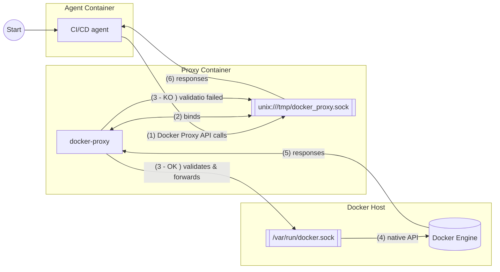

# Docker Socket Proxy - CI/CD Security & Granular Access Control

> **Secure Docker proxy for CI/CD, DevOps and multi-tenant environments** with advanced and granular filtering system.

[](https://hub.docker.com/r/hypolas/proxy-docker)
[](https://github.com/hypolas/docker-proxy)
[-blue)](LICENSE)

A professional Docker socket proxy with **advanced regex filtering**, specifically designed to **secure CI/CD pipelines** (GitHub Actions, GitLab CI, Jenkins, CircleCI, etc.) and **cloud-native environments**. Inspired by [Tecnativa/docker-socket-proxy](https://github.com/Tecnativa/docker-socket-proxy), implemented in high-performance Go with Gin and Resty.

**🐳 Docker Hub:** [hypolas/proxy-docker](https://hub.docker.com/r/hypolas/proxy-docker)
**📦 GitHub:** [hypolas/docker-proxy](https://github.com/hypolas/docker-proxy)

## 🎯 Main Use Cases

### 🔧 CI/CD & DevOps
**Ideal for securing your CI/CD pipelines** by exposing only the necessary Docker functionalities:
- ✅ **GitHub Actions, GitLab CI, Jenkins**: Limit allowed Docker actions
- ✅ **Secure Docker-in-Docker (DinD)**: Control build, push, run
- ✅ **Mandatory private registry**: Force usage of your internal registries
- ✅ **Ban :latest tag**: Enforce semantic versioning
- ✅ **Complete audit**: Structured logs of all operations

### ☁️ Cloud Platforms & Multi-tenant
- **Kubernetes, Docker Swarm, Nomad**: Isolation between namespaces/tenants
- **PaaS & Container-as-a-Service**: Granular control per client
- **Shared environments**: Strict security and isolation

### 🏢 Enterprise & Production
- **Zero-trust architecture**: Least privilege principle applied
- **Compliance & Audit**: Complete traceability of operations
- **Multi-layer security**: Protection against privilege escalation

---

## ✨ Main Features

### 🚀 Why This Proxy?

This Docker proxy offers **advanced security for your Docker environments** through:
- **Policy enforcement** and **RBAC** for Docker API
- **Admission control** for containers with regex filters
- **Zero-trust architecture** applied to Docker socket
- **Multi-tenant isolation** with granular namespace control
- **Container escape prevention** via volume and privilege restrictions
- **Complete audit trail** of all Docker operations

Ideal for **cloud-native security**, **Kubernetes**, **Docker Swarm**, **PaaS**, and **CI/CD pipelines** (GitHub Actions, GitLab CI, Jenkins, CircleCI, Azure DevOps).

### 🎯 Granular Access Control
- **ACL per endpoint**: Enable only necessary Docker endpoints
- **Advanced filters with regex**: Precise control over volumes, containers, images, networks
- **Content filtering**: Inspect and validate requests before forwarding
- **Flexible configuration**: JSON or environment variables (priority)

### 🔐 Multi-Layer Security
- **Docker socket protection**: Blocked by default to prevent privilege escalation
- **Self-protection**: Proxy protects itself against any manipulation
- **Read-only mode**: Disable POST/DELETE/PUT by default
- **Auto-detection**: Docker API version auto-detected

### 🛠️ Advanced Filter Examples
```bash
# Block mounting sensitive directories
export DKRPRX__VOLUMES__DENIED_PATHS="^/etc/.*,^/root/.*,^/home/.*"

# Allow only images from a private registry
export DKRPRX__CONTAINERS__ALLOWED_IMAGES="^registry.company.com/.*"

# Block :latest tag
export DKRPRX__IMAGES__DENIED_TAGS="^latest$"

# Block privileged containers
export DKRPRX__CONTAINERS__DENY_PRIVILEGED="true"

# Require specific labels
export DKRPRX__CONTAINERS__REQUIRE_LABELS="env=production,team=backend"
```

## ⚠️ Disclaimer

**THIS SOFTWARE IS PROVIDED "AS IS", WITHOUT WARRANTY OF ANY KIND.**

The developer disclaims all liability concerning:
- Direct or indirect damages caused by using this software
- Security flaws or vulnerabilities
- Data loss or service interruption
- Any malicious or inappropriate use

**You use this proxy at your own risk.** It is your responsibility to:
- Properly configure security filters
- Test the configuration in a development environment
- Regularly audit access and logs
- NEVER expose the proxy on a public network

## 🚀 Installation

### Option 1: Docker Hub (Recommended)

Pull the pre-built image from Docker Hub:

```bash
# Pull latest version
docker pull hypolas/proxy-docker:latest

# Or specific version
docker pull hypolas/proxy-docker:1.0.0

# Run it
docker run -d \
  --name docker-proxy \
  -v /var/run/docker.sock:/var/run/docker.sock:ro \
  -p 2375:2375 \
  -e CONTAINERS=1 \
  -e IMAGES=1 \
  hypolas/proxy-docker:latest
```

**Multi-platform support:**
- ✅ `linux/amd64` (x86_64)
- ✅ `linux/arm64` (ARM 64-bit - Raspberry Pi 4, Apple M1/M2, AWS Graviton)
- ✅ `linux/arm/v7` (ARM 32-bit - Raspberry Pi 2/3)

### Option 2: Pre-compiled Binaries

Download ready-to-use binaries from GitHub Releases:

```bash
# Linux amd64
wget https://github.com/hypolas/docker-proxy/releases/latest/download/docker-proxy-linux-amd64
chmod +x docker-proxy-linux-amd64
./docker-proxy-linux-amd64

# macOS Apple Silicon
wget https://github.com/hypolas/docker-proxy/releases/latest/download/docker-proxy-darwin-arm64
chmod +x docker-proxy-darwin-arm64
./docker-proxy-darwin-arm64

# Windows
# Download from: https://github.com/hypolas/docker-proxy/releases/latest
```

**Available platforms:**
- Linux: amd64, arm64, armv7
- macOS: amd64 (Intel), arm64 (Apple Silicon)
- Windows: amd64

**Verify checksums:**
```bash
wget https://github.com/hypolas/docker-proxy/releases/latest/download/checksums.txt
sha256sum -c checksums.txt --ignore-missing
```

### Option 3: Build from Source

```bash
# Clone repository
git clone https://github.com/hypolas/docker-proxy.git
cd docker-proxy

# Build binary
go mod download
go build -o docker-proxy ./cmd/docker-proxy

# Or build Docker image
docker build -t hypolas/proxy-docker .
```

## 📋 Configuration

Configuration is done via environment variables:

### Basic Configuration

| Variable | Description | Default |
|----------|-------------|---------|
| `LISTEN_SOCKET` | 🔒 **Recommended**: Unix socket to listen on (format: `unix:///path` or `/path`). Takes priority over `LISTEN_ADDR`. More secure than TCP. | - |
| `LISTEN_ADDR` | TCP listen address (less secure, use `LISTEN_SOCKET` if possible) | `:2375` |
| `DOCKER_SOCKET` | Path to Docker socket (formats: `unix:///path`, `/path`, or `tcp://host:port`) | `unix:///var/run/docker.sock` |
| `LOG_LEVEL` | Log level (debug, info, warn, error) | `info` |
| `API_VERSION` | Docker API version (auto-detected if not set) | Auto-detection |
| `SOCKET_PERMS` | Permissions for Unix socket created by proxy (octal format) | `0666` |

> 🔒 **Security**: Prefer `LISTEN_SOCKET` (Unix socket) over `LISTEN_ADDR` (TCP). Unix sockets offer better permission control via the filesystem and avoid network exposure.

### Endpoint Access Control

Allowed **by default** (value: `1`):
- `EVENTS` - Docker events
- `PING` - Healthcheck
- `VERSION` - Docker version

**Denied** by default (value: `0`), must be explicitly enabled:
- `AUTH` - Authentication
- `BUILD` - Image building
- `COMMIT` - Container commit
- `CONFIGS` - Swarm configs
- `CONTAINERS` - Container management
- `DISTRIBUTION` - Image distribution
- `EXEC` - Command execution
- `IMAGES` - Image management
- `INFO` - System information
- `NETWORKS` - Network management
- `NODES` - Swarm nodes
- `PLUGINS` - Docker plugins
- `SECRETS` - Swarm secrets
- `SERVICES` - Swarm services
- `SESSION` - Sessions
- `SWARM` - Swarm mode
- `SYSTEM` - Docker system
- `TASKS` - Swarm tasks
- `VOLUMES` - Volume management

### HTTP Methods

- `GET`, `HEAD`: Always allowed (read-only)
- `POST`: Default `0` (set `POST=1` to enable)
- `DELETE`: Default `0` (set `DELETE=1` to enable)
- `PUT`, `PATCH`: Default `0` (set `PUT=1` to enable)

## 💡 Usage Examples

### Read-only mode (default)

```bash
export CONTAINERS=1
export IMAGES=1
./docker-proxy
```

### Read-write mode

```bash
export CONTAINERS=1
export IMAGES=1
export POST=1
export DELETE=1
./docker-proxy
```

### Listen on Unix socket (recommended for security)

```bash
# Listen on Unix socket instead of TCP
export LISTEN_SOCKET=unix:///tmp/docker-proxy.sock
export CONTAINERS=1
export IMAGES=1
./docker-proxy

# Test with curl
curl --unix-socket /tmp/docker-proxy.sock http://localhost/v1.41/containers/json
```

> 🔒 **Security**: `LISTEN_SOCKET` always takes precedence over `LISTEN_ADDR`. Unix sockets avoid network exposure and offer better permission control.
>
> ⚠️ **Docker**: If you use `LISTEN_SOCKET=unix:///tmp/docker-proxy.sock`, you must mount the corresponding directory in volumes: `-v /tmp:/tmp`. The path in the `unix:///path` format must match the mounted volume.

# Architecture
## With a Docker agent:

Proxy configuration sample:

```yaml
services:
  docker-proxy:
    build: .
    image: hypolas/proxy-docker:latest
    container_name: docker-proxy
    volumes:
      - /var/run/docker.sock:/var/run/docker.sock:ro
      - /tmp:/tmp  # ⚠️ IMPORTANT: must match the path in LISTEN_SOCKET
    environment:
      # Basic configuration (unix:// format recommended)
      - LISTEN_SOCKET=unix:///tmp/docker_proxy.sock
      - DOCKER_SOCKET=unix:///var/run/docker.sock
```

> ⚠️ **Important**: The mounted volume (`/tmp:/tmp`) must match the path defined in `LISTEN_SOCKET`. If you use `LISTEN_SOCKET=unix:///tmp/docker_proxy.sock`, you must mount `/tmp:/tmp`.



### 🔧 CI/CD Integration

#### GitHub Actions

```yaml
# .github/workflows/docker.yml
name: Docker Build
on: [push]

services:
  docker-proxy:
    image: hypolas/proxy-docker:latest
    env:
      CONTAINERS: 1
      IMAGES: 1
      BUILD: 1
      POST: 1
      # Force private registry
      DKRPRX__CONTAINERS__ALLOWED_IMAGES: "^registry.company.com/.*"
      # Block :latest
      DKRPRX__IMAGES__DENIED_TAGS: "^latest$"
      LISTEN_SOCKET: unix:///tmp/docker-proxy.sock
    volumes:
      - /var/run/docker.sock:/var/run/docker.sock:ro
      - /tmp:/tmp  # ⚠️ Required for LISTEN_SOCKET unix:///tmp/docker-proxy.sock

jobs:
  build:
    runs-on: ubuntu-latest
    steps:
      - uses: actions/checkout@v3
      - name: Build Docker image
        env:
          DOCKER_HOST: /tmp/docker-proxy.sock
        run: docker build -t registry.company.com/app:${{ github.sha }} .
```

#### GitLab CI

```yaml
# .gitlab-ci.yml
variables:
  DOCKER_HOST: unix:///tmp/docker-proxy.sock

  - name: hypolas/proxy-docker:latest
    alias: docker-proxy
    volumes:
      - /var/run/docker.sock:/var/run/docker.sock:ro
      - /tmp:/tmp  # ⚠️ Required for LISTEN_SOCKET
    variables:
      CONTAINERS: "1"
      IMAGES: "1"
      BUILD: "1"
      POST: "1"
      DKRPRX__CONTAINERS__ALLOWED_IMAGES: "^registry.company.com/.*"
      LISTEN_SOCKET: unix:///tmp/docker-proxy.sock

build:
  script:
    - docker build -t registry.company.com/app:$CI_COMMIT_SHA .
    - docker push registry.company.com/app:$CI_COMMIT_SHA
```

#### Jenkins Pipeline

```groovy
pipeline {
  agent any
  environment {
    DOCKER_HOST = 'tcp://docker-proxy:2375'
  }
  stages {
    stage('Build') {
      steps {
        sh 'docker build -t registry.company.com/app:${BUILD_NUMBER} .'
      }
    }
  }
}
```

### With Docker Compose

```yaml
services:
  docker-proxy:
    build: .
    ports:
      - "2375:2375"
    volumes:
      - /var/run/docker.sock:/var/run/docker.sock:ro
    environment:
      - CONTAINERS=1
      - IMAGES=1
      - NETWORKS=1
      - VOLUMES=1
      - POST=0
      - DELETE=0
      - LOG_LEVEL=info
```

### With Dockerfile

```dockerfile
FROM golang:1.21-alpine AS builder

WORKDIR /app
COPY go.mod go.sum ./
RUN go mod download

COPY . .
RUN CGO_ENABLED=0 GOOS=linux go build -o docker-proxy ./cmd/docker-proxy

FROM alpine:latest
RUN apk --no-cache add ca-certificates
WORKDIR /root/

COPY --from=builder /app/docker-proxy .

EXPOSE 2375

CMD ["./docker-proxy"]
```

## 🏗️ Architecture

```
.
├── cmd/
│   └── docker-proxy/       # Application entry point
│       └── main.go
├── config/                 # Configuration and env var loading
│   └── config.go
├── internal/
│   ├── middleware/         # Gin middlewares
│   │   ├── acl.go         # Access control
│   │   └── logging.go     # Structured logging
│   └── proxy/             # Proxy handler
│       └── handler.go
└── pkg/
    └── rules/             # Access rules engine
        └── matcher.go
```

## 🔐 Advanced Filtering System

**The proxy's strength: an extremely granular and powerful filtering system.**

### 🎯 Precise Control with Regex

Unlike basic proxies, this proxy allows **fine-grained control of every aspect** of Docker operations via regex patterns:

#### 📦 Volume Filters
```bash
# Allow only specific named volumes
export DKRPRX__VOLUMES__ALLOWED_NAMES="^data-.*,^app-.*,^logs-.*"

# Block mounting sensitive system directories
export DKRPRX__VOLUMES__DENIED_PATHS="^/etc/.*,^/root/.*,^/sys/.*,^/proc/.*,^/var/run/.*"

# Allow only bind mounts in /data
export DKRPRX__VOLUMES__ALLOWED_PATHS="^/data/.*"

# Restrict to local drivers
export DKRPRX__VOLUMES__ALLOWED_DRIVERS="local"
```

#### 🐳 Container Filters
```bash
# Allow only images from private registry with semantic versioning
export DKRPRX__CONTAINERS__ALLOWED_IMAGES="^registry.company.com/.*:v[0-9]+\.[0-9]+\.[0-9]+$"

# Block any image with :latest or :dev tag
export DKRPRX__CONTAINERS__DENIED_IMAGES=".*:(latest|dev|test)$"

# Require container names prefixed by environment
export DKRPRX__CONTAINERS__ALLOWED_NAMES="^(prod|staging|dev)-.*"

# Require mandatory labels
export DKRPRX__CONTAINERS__REQUIRE_LABELS="env=production,team=backend,cost-center=IT-001"

# Block privileged containers and host network
export DKRPRX__CONTAINERS__DENY_PRIVILEGED="true"
export DKRPRX__CONTAINERS__DENY_HOST_NETWORK="true"
```

#### 🖼️ Image Filters
```bash
# Allow only approved registries
export DKRPRX__IMAGES__ALLOWED_REPOS="^(docker\.io/library|registry\.company\.com)/.*"

# Block insecure registries
export DKRPRX__IMAGES__DENIED_REPOS=".*\.(cn|ru|suspicious)/"

# Allow only versioned tags (semver)
export DKRPRX__IMAGES__ALLOWED_TAGS="^v[0-9]+\.[0-9]+\.[0-9]+$"

# Block development tags
export DKRPRX__IMAGES__DENIED_TAGS="^(latest|dev|test|alpha|beta|rc).*"
```

#### 🌐 Network Filters
```bash
# Allow only application networks
export DKRPRX__NETWORKS__ALLOWED_NAMES="^app-.*"

# Block host network (security)
export DKRPRX__NETWORKS__DENIED_NAMES="^host$"

# Restrict to bridge and overlay drivers
export DKRPRX__NETWORKS__ALLOWED_DRIVERS="bridge,overlay"
```

### 📋 Configuration via JSON (Alternative)

For complex configurations, use JSON:

```json
{
  "volumes": {
    "allowed_names": ["^data-.*", "^app-.*"],
    "denied_paths": ["^/etc/.*", "^/root/.*", "^/sys/.*", "^/proc/.*"],
    "allowed_paths": ["^/data/.*", "^/mnt/volumes/.*"]
  },
  "containers": {
    "allowed_images": ["^registry.company.com/.*:v[0-9]+\\.[0-9]+\\.[0-9]+$"],
    "denied_images": [".*:(latest|dev)$"],
    "require_labels": {
      "env": "production",
      "approved": "true"
    },
    "deny_privileged": true,
    "deny_host_network": true
  },
  "networks": {
    "allowed_names": ["^app-.*"],
    "allowed_drivers": ["bridge", "overlay"]
  },
  "images": {
    "allowed_repos": ["^registry.company.com/.*"],
    "denied_tags": ["^latest$"]
  }
}
```

```bash
export FILTERS_CONFIG=./filters.json
```

**Note:** Environment variables take **priority** over JSON.

### 💡 Advanced Use Cases

#### Multi-tenant with Isolation
```bash
TENANT_ID="client-123"
export DKRPRX__VOLUMES__ALLOWED_NAMES="^${TENANT_ID}-.*"
export DKRPRX__CONTAINERS__ALLOWED_NAMES="^${TENANT_ID}-.*"
export DKRPRX__CONTAINERS__REQUIRE_LABELS="tenant=${TENANT_ID}"
export DKRPRX__NETWORKS__ALLOWED_NAMES="^${TENANT_ID}-.*"
```

#### Strict Production Environment
```bash
# Only versioned images from private registry
export DKRPRX__CONTAINERS__ALLOWED_IMAGES="^registry.prod.company.com/.*:v[0-9]+\.[0-9]+\.[0-9]+$"

# Only mounts in /data/prod
export DKRPRX__VOLUMES__ALLOWED_PATHS="^/data/prod/.*"

# Mandatory labels
export DKRPRX__CONTAINERS__REQUIRE_LABELS="env=production,approved=true,security-scan=passed"

# Enhanced security
export DKRPRX__CONTAINERS__DENY_PRIVILEGED="true"
export DKRPRX__CONTAINERS__DENY_HOST_NETWORK="true"
```

#### CI/CD with Restrictions
```bash
# Allow build but not latest
export DKRPRX__IMAGES__DENIED_TAGS="^latest$"

# Allow only CI registry
export DKRPRX__IMAGES__ALLOWED_REPOS="^registry.ci.company.com/.*"

# Block sensitive volumes
export DKRPRX__VOLUMES__DENIED_PATHS="^/(etc|root|home|sys|proc)/.*"
```

### 📚 Complete Documentation

- **[ADVANCED_FILTERS.md](ADVANCED_FILTERS.md)** - Complete guide to advanced filters with detailed examples
- **[ENV_FILTERS.md](ENV_FILTERS.md)** - Configuration via environment variables
- **[SECURITY.md](SECURITY.md)** - Security guide and blocked attack vectors

**The filtering system allows as precise control as needed for your environment!**

## 🔒 Security by Default

The proxy applies **several protections by default** to prevent privilege escalation:

### 🛡️ Docker Socket Protection
The following paths are **blocked by default**:
- `/var/run/docker.sock`
- `/run/docker.sock`

### 🛡️ Proxy Container Protection
The `docker-proxy` container itself is **protected against any manipulation**:
- ❌ Cannot stop/restart the proxy container
- ❌ Cannot modify the proxy container
- ❌ Cannot delete the proxy container

### 🛡️ Proxy Network Protection
If the proxy uses a dedicated network, it is also protected.

### ⚙️ Configuration
```bash
# Proxy container name (default: docker-proxy)
export PROXY_CONTAINER_NAME="docker-proxy"

# Proxy network name (optional)
export PROXY_NETWORK_NAME="docker-proxy-network"
```

### 🔓 Disabling (not recommended)
To disable all protections:
```bash
export DKRPRX__DISABLE_DEFAULTS="true"
```

To explicitly allow Docker socket:
```bash
export DKRPRX__VOLUMES__ALLOWED_PATHS="^/var/run/docker\\.sock$"
```

## ⚠️ Security Warnings

- **NEVER expose this proxy on a public network**
- **NEVER mount the Docker socket in an unsecured container**
- Enable only necessary endpoints
- Use read-only mode when possible
- Mount Docker socket as read-only when possible (`:ro`)
- Use advanced filters for granular control

## 🧪 Tests

To test the proxy:

### TCP mode (default)

```bash
# Start proxy with containers in read-only
export CONTAINERS=1
./docker-proxy

# In another terminal
curl http://localhost:2375/v1.41/containers/json

# Test a denied endpoint
curl http://localhost:2375/v1.41/images/json  # 403 Forbidden
```

### Unix socket mode

```bash
# Start proxy on Unix socket
export LISTEN_SOCKET=/tmp/docker-proxy.sock
export CONTAINERS=1
./docker-proxy

# In another terminal
curl --unix-socket /tmp/docker-proxy.sock http://localhost/v1.41/containers/json

# Or with Docker CLI
export DOCKER_HOST=unix:///tmp/docker-proxy.sock
docker ps
```

## 🔧 CI/CD Integration

This proxy is **specifically designed to secure CI/CD pipelines**. See [CICD_EXAMPLES.md](docs/CICD_EXAMPLES.md) for detailed examples:

- **GitHub Actions** - Secure Docker in workflows
- **GitLab CI** - Granular access control with services
- **Jenkins** - Secure pipeline with Docker proxy
- **Azure DevOps** - Integration with ACR
- **CircleCI** - Secure build with remote Docker

**Typical use cases:**
- Force use of private registry only
- Block `:latest`, `:dev`, `:test` tags
- Block privileged containers in CI
- Complete audit of Docker operations
- Multi-tenant isolation in shared runners

## 🔐 Security

See [SECURITY.md](docs/SECURITY.md) for:
- Implemented default protections
- Blocked attack vectors
- Production security checklist
- Deployment best practices

## 📝 License

**Dual License: GPL-3.0 (Free) OR Commercial**

- 🆓 **FREE** for open-source projects (GPL-3.0)
- 💼 **Commercial license** for proprietary/closed-source use
- 📋 See [LICENSE](LICENSE) for complete terms
- 💰 Pricing: Startup €500/year, SME €2k/year, Enterprise €10k/year

Contact nicolas.hypolite@gmail.com for commercial licensing.

---

## 🏆 Technical Advantages

### Architecture & Performance
Developed in **high-performance Go (Golang)** with **Gin framework** and **Resty HTTP client**, this proxy offers a robust **API wrapper** around the **Docker Engine API** and **Docker SDK**. Native support for **Unix sockets** and **TCP sockets** for flexible integration.

### Advanced Security
Implements **zero-trust**, **least privilege**, and **defense in depth** principles to prevent:
- **Privilege escalation prevention**: Block privileged containers and host network
- **Container escape prevention**: Strict restrictions on volumes and bind mounts
- **Socket injection prevention**: Automatic Docker socket protection

### Filtering & Control
- **Regex-based filtering**: Advanced patterns for images, volumes, networks
- **Network policy** and granular **volume restriction**
- **Image policy** and customizable **tag policy**
- **Label enforcement** for organizational compliance
- **Registry whitelist**: Force use of approved registries

### CI/CD Integrations
Native compatibility with:
- **GitHub Actions**, **GitLab CI/CD**, **Jenkins**, **CircleCI**, **Azure DevOps**
- **Travis CI**, **Drone CI**, **Bamboo**, **TeamCity**
- Improved **Docker-in-Docker (DinD) security**
- **Kubernetes admission controller** via webhook

### Orchestrators & Platforms
Support for:
- **Kubernetes** (pods, deployments, namespaces)
- **Docker Swarm** (services, stacks, secrets)
- **HashiCorp Nomad** (jobs, tasks)
- **Rancher**, **Portainer**, **OpenShift**
- Any platform using **Docker API**

---

**Developed for DevOps, SRE and Security teams seeking granular control over Docker in multi-tenant, cloud-native and CI/CD environments.**
